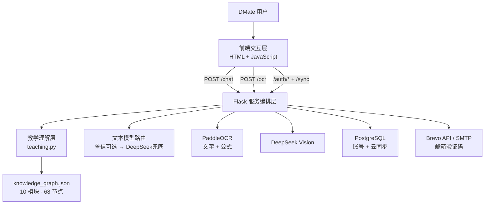

# DMate

**离散数学智能辅学系统**

DMate 是面向高校离散数学学习场景的 AI 智能辅学产品。系统以自由式学习交互为入口，将文本提问、图片识题、教学模式控制、知识识别、题目状态管理、难度分级、AI 练习生成、错题订正复测、知识图谱、学习回顾、账号与多设备同步组织到同一学习流程中。

## 项目信息

- 项目主名：DMate
- 完整说明：离散数学智能辅学系统
- 参赛方向：人工智能 + 教育创新
- 学校：中国海洋大学
- 学部：信息科学与工程学部
- 项目负责人：朱明
- 年级：2025 级
- 专业：物理学
- 团队形式：单人项目
- 指导教师：宋宁
- 在线地址：https://dmate.zeabur.app
- 当前部署平台：Zeabur
- 部署历程：Render → Zeabur
- 当前服务器记录：Tencent Seoul 2C 4GB（2 核 CPU / 4 GB 内存）
- 当前服务器费用记录：US$4/月；Zeabur 已初次开通 1 次、续费 1 次，共 **2 次付款**（按套餐标价粗略估算为 US$8，实际扣款以 Zeabur 账单为准）。
- 截至 2026-10-08，DeepSeek API 后台显示 **累计消费 ¥101.96**、**充值余额 ¥8.03**；余额不是累计消费，均不等同于单用户运行成本。

## 核心功能

### 1. AI 教学辅导

`teaching.py` 将用户学习意图划分为五类教学模式：

- 提示引导
- 完整解析
- 概念讲解
- 练习出题
- 答案诊断

题目求解默认采用“提示优先”：先指出知识点与关键思路；用户明确要求完整答案时，再进入完整解析。

### 2. 离散数学知识识别与难度分级

`teaching.py` 使用可解释规则识别 10 个课程模块，并将结果与 `knowledge_graph.json` 中的知识节点连接。当前知识图谱包含 **10 个模块、68 个节点**（其中图论 21 个、初等数论 7 个）。

正式题目会进一步给出：

- `category`
- `knowledge_points`
- `focus_points`
- `prerequisite_points`
- `knowledge_path`
- `question_type`
- `difficulty`

题目难度严格使用三档：**简单 / 中等 / 困难**。难度只用于真实题目与正式生成题，不把普通功能讨论或纯元问题当成题目评级。题型优先识别选择、填空、证明、作图、构造、判断、计算等明确类型，无法细分时回退为“一般题”。

本次能力校准覆盖图同构、二部图、拓扑排序、模逆与中国剩余定理，以及由 `a_n` 递推公式识别线性齐次 / 非齐次递推；校准了多步题的中等难度识别。该能力属于规则判定，不代表可以保证全部离散数学题都被准确分类。

文本模型会按题目难度调整思考强度：简单题使用普通路径，中等题启用 `high` 思考，困难题启用 `max` 思考。

### 3. 图片识题与图形结构理解

图片入口采用两层处理：

1. PaddleOCR 识别普通文字与数学公式；
2. DeepSeek Vision 校对文字，并补充图、树、哈斯图、箭头、二维结构等 OCR 难以表达的信息。

Vision 负责结构补充，不直接替代教学模块解题。Vision 调用失败时尽量保留 OCR 结果；普通 OCR 暂不可用时，后端仍允许 Vision 处理纯图结构。前端支持撤销正在进行的图片识别请求。新增图片用途识别：明确非习题的课件、笔记和照片返回 422 并阻止进入解题；不确定或纯图题保留核对入口，避免误拦截。识别期间桌面隐藏“图片识题”、手机隐藏“＋”入口，输入框自然补位，红色撤销按钮保留；手机 OCR 核对页操作按钮固定底部，内容区独立滚动。该判断依赖模型，不能承诺所有非题目图片均可识别。

### 4. AI 练习生成与难度控制

明确出题请求通过结构化 `request_kind="exercise"` 传入后端。后端会：

- 重新确认出题意图；
- 提取并登记 `generated_question`；
- 生成 `generated_teaching`；
- 将可见题目与隐藏参考答案分离；
- 对生成题重新执行课程分类与难度估计。

出题难度规则：

- 用户明确指定“简单 / 中等 / 困难”时，以用户要求为准；
- “照这题再出一道”且未指定难度时，继承参照题难度；
- 独立的泛化“出一道题”默认中等；
- 未明确指定难度时，默认提示模型生成中等题，但不会仅因规则估计难度不同而丢弃有效题；明确要求难度时可以重试一次，仍偏离时保留通过其他校验的有效题目，故最终难度不保证完全符合要求。
- 对“照这题再出一道 / 同知识点复测”，除模块一致性外，已能识别的核心知识点也必须有交集，避免“图同构 → 最短路”这种同属图论却偏题的生成结果。知识点偏离时会拒绝该题并提示重新生成；该规则依赖识别结果，不构成数学正确性验证。

因此 AI 生成题不是普通聊天文本，而是能够进入题目历史、错题、订正和复测流程的正式学习对象。

### 5. 当前题与历史题状态管理

前端维护题目候选、题目指纹与教学快照，并优先把自然语言指代解析成明确题目对象。支持：

- “第一题”“第 2 题”等正序题号；
- “倒数第一题”“倒数第二题”；
- “上一道题”“下一道题”“往后 2 道题”；
- “最开始那道题”“最后一道题”“当前题”；
- “第 2 题的下一题”等组合导航；
- “集合那道题”“数论那道题”等主题指代；
- “继续”“为什么”“再解释一下”等短追问保持。

“第 2 小题”“第 2 问”等当前大题内部编号不会被误当成会话历史第 2 道题。显式目标不存在时返回定位失败提示，不静默切换到别的题。

当前上下文容量：

- 后端单次最多接收 32 条消息；
- AI 历史最多保留 32 条消息；
- AI 历史总字符预算 60,000；
- 单条消息上限 6,000 字符；
- 显式题目状态不可用时，前端回退到最近 12 条自然语言消息。

### 6. 错题—订正—复测闭环

错题本支持：

- 记为错题；
- 答案与解析；
- 笔记编辑；
- 完成订正；
- 针对原知识点生成新题复测；
- 提交复测答案并记录正确、错误或待继续判断；
- 搜索、筛选、排序；
- PDF 导出。

复测新会话直接保存原错题 `referenceQuestion`，并通过 `exercise_reference` 显式提交原题。生成结果保存 `generated_question` 与隐藏的 `generated_answer`；提交答案时只核验本次复测题，避免混入原错题或其他历史题。

当前错题上限为 80 条。

### 7. 知识图谱与学习回顾

知识图谱用于展示当前题知识点、建议前置知识、直接后续知识，以及当前题 / 当前会话 / 历史题范围的知识聚焦。

`prerequisites` 表示建议学习前置/依赖关系，不等同于严格数学逻辑蕴含；知识图谱不记录学生“掌握度”。

学习回顾只依据真实学习记录与错题状态组织内容，不生成无数据依据的能力百分比。

### 8. 账号、邮箱验证与多设备同步

账号系统基于 PostgreSQL，支持：

- 用户名 + 邮箱 + 密码 + 6 位邮箱验证码注册；
- 注册成功后自动登录；
- 用户名或邮箱登录；
- 已登录旧账号绑定 / 更换邮箱；
- 邮箱验证码重置密码；
- 用户名 + 恢复码作为备用重置方式；
- 登录后使用当前密码修改恢复码；
- 退出登录；
- 输入当前密码永久注销账号。

注册时系统自动生成一枚高熵恢复码，明文只在注册成功响应中返回一次，服务端只保存 scrypt 哈希。

邮箱验证码为 6 位数字，10 分钟有效；同一用途 60 秒后可重发，单邮箱同用途每小时最多 8 次，单个验证码最多允许 6 次错误尝试。事务邮件优先通过 Brevo API 发送，失败时可自动回退 SMTP。

### 9. 游客模式与云同步

DMate 区分游客和登录用户：

- **游客模式**：聊天、学习记录与外观设置只在当前页面生命周期内存在，不写入持久 `localStorage`；关闭或刷新后不保证保留。
- **登录模式**：本机保存缓存，并通过 `/sync` 将会话、学习状态、错题、复测状态与外观参数同步到 PostgreSQL。
- 云同步使用 `revision` 做冲突检测；多设备同时修改时由前端提示选择“覆盖云端”或“使用云端最新数据”。
- 单次云端同步 JSON 上限为 5 MiB。
- 自定义背景图片本体仍保存在当前设备 IndexedDB，不上传到云端；背景相关参数可随账号同步。

退出登录后，界面会清空并回到真正的游客状态。

### 10. 数学渲染、复制与导出

前端使用：

- Marked：Markdown 解析；
- DOMPurify：HTML 清洗；
- MathJax：LaTeX → SVG 数学渲染；
- html2canvas + jsPDF：错题 PDF 导出。

MathJax 使用 `fontCache: 'none'`，PDF 导出前处理 MathJax SVG 与辅助 MathML，降低重复绘制风险。

**富文本与公式复制**是前端已有的独立能力，不只是复制原始字符串：

- **保留视觉效果**：复制渲染后的内容时，优先同时写入剪贴板 `text/html` 与 `text/plain`。富文本包含段落、标题、列表、表格、代码等格式；已渲染的 MathJax 公式在 HTML 中转为嵌入式 SVG 图片，供支持富文本的粘贴目标保留视觉效果。
- **纯文本降级**：不支持富文本剪贴板的浏览器回退为文本，公式转为 `$...$` 或 `$$...$$` LaTeX 表示；不承诺粘贴到所有软件后都保持可视公式。
- **局部选择复制**：支持用户拖选文字与公式混排区域；公式 SVG 还实现了按字形范围选中、高亮和复制，尽量只复制被选中的局部，而非强制整段复制。选区高亮颜色统一；行为依赖浏览器选择与剪贴板权限。
- **复制入口精简**：聊天区只对可识别的**完整题目**展示题目复制入口，不对普通寒暄、追问或 AI 讲解滥加按钮；错题本提供每题复制，复制时清理按钮等无关控件；知识图谱侧重点是**复制图谱图片**，不是复制一串节点文字。
- **图谱复制为图片**：导出的是完整知识图谱 PNG，支持图片剪贴板时直接复制；受浏览器限制不能写入图片剪贴板时尝试保存 PNG，不悄悄退回到纯文字。

**错题 PDF**按题组织，导出前对公式做渲染处理，避免同一道题在导出中重复出现。以上能力均属于代码设计与兼容性实现，实际粘贴样式仍取决于目标应用和设备浏览器。

### 11. 个性化外观

外观模式：

- 跟随系统
- 白色
- 黑色
- 蓝色

同时支持蓝 / 紫 / 青绿强调色、字号、全局背景、背景适配、遮罩、模糊、面板透明度与对话气泡透明度。

默认打开使用白色模式。游客外观不持久化；登录用户的外观参数可随账号同步，自定义背景图片本体仅在当前设备保存。

## AI 运行链路

文本回答代码支持两级提供方：

1. 可选的鲁信杯 OpenAI-compatible 文本接口作为优先通道；
2. 官方 DeepSeek Chat Completions 作为长期兜底。

鲁信通道支持开关、后台探测与熔断；不可用时直接回退 DeepSeek，避免外部算力通道成为单点故障。DeepSeek 文本模型通过 `DEEPSEEK_CHAT_MODEL` 配置，当前代码默认 `deepseek-flash`。

图片结构理解继续走 DeepSeek Vision 路径，模型通过 `DEEPSEEK_VISION_MODEL` 配置，当前代码默认 `deepseek-flash`。

## 技术架构



详见 [`docs/ARCHITECTURE.md`](docs/ARCHITECTURE.md)。

## 已安装客户端如何获得更新

当前 Windows / macOS / Linux 桌面端采用 Tauri 远程网页壳，Android 采用 WebView 远程网页壳；二者均打开 `https://dmate.zeabur.app`，不内置 Flask 后端或整套网页业务源码。因此：

- **后端能力**（`app.py`、`teaching.py`、`knowledge_graph.json`）更新并成功部署到 Zeabur 后，已安装客户端的新请求会使用更新后的服务端逻辑；无需重新打包客户端。
- **网页前端**（`static/script.js`、`templates/index.html` 等）更新并成功部署后，客户端重新加载远程页面即可获取新版；若旧资源还在缓存中，可关闭重开或刷新页面。
- **原生壳**（Android Java / Manifest / Gradle、Tauri Rust / 配置 / 权限等）本身有变更时，需要重新构建、分发并安装新版本。当前工程**没有实现安装包二进制自动更新**；远程网页更新不等于安装包自动升级。
- iOS 主屏幕 Web App 使用 Service Worker，在线时优先拉取网络内容、离线时可能使用旧缓存，因此新内容生效时间还受缓存与网络状况影响。

更详细的部署流程与更新边界见 [`docs/DEPLOYMENT.md`](docs/DEPLOYMENT.md)。

## 主要接口

| 方法 | 路径 | 作用 |
|---|---|---|
| GET | `/` | 主页面 |
| POST | `/chat` | AI 教学对话、题目锚定、难度控制与生成题登记 |
| POST | `/analyze-questions` | 批量规则化分析历史题目 |
| POST | `/ocr` | OCR + Vision 图片题理解 |
| POST | `/ocr/cancel` | 撤销图片识别请求 |
| GET | `/auth/me` | 当前账号状态 |
| POST | `/auth/email/send-code` | 注册 / 重置 / 绑定邮箱验证码 |
| POST | `/auth/register` | 邮箱验证注册 |
| POST | `/auth/login` | 用户名或邮箱登录 |
| POST | `/auth/email/bind` | 绑定 / 更换邮箱 |
| POST | `/auth/recovery-code` | 修改恢复码 |
| POST | `/auth/recover-password-email` | 邮箱验证码重置密码 |
| POST | `/auth/recover-password` | 恢复码重置密码 |
| POST | `/auth/logout` | 退出登录 |
| POST | `/auth/delete-account` | 永久注销账号 |
| GET / PUT | `/sync` | 云端数据读取 / 写入与冲突检测 |
| GET | `/health` | Web 服务健康状态 |
| GET | `/ready` | Web 与 OCR 就绪状态 |

详见 [`docs/API.md`](docs/API.md)。

## 运行环境与直接依赖

项目 Docker 基础镜像记录为 `python:3.10-slim`。

```text
Flask==3.1.2
requests==2.32.5
gunicorn==23.0.0
paddlepaddle==3.3.1
paddleocr[doc-parser]==3.7.0
numpy==1.26.4
opencv-contrib-python==4.10.0.84
Pillow==11.3.0
psycopg[binary]>=3.2.0,<4.0
```

前端直接加载：

```text
MathJax 3.2.2
Marked 15.0.12
DOMPurify 3.2.6
html2canvas 1.4.1
jsPDF 2.5.2
```

第三方许可证见 [`THIRD_PARTY_LICENSES.md`](THIRD_PARTY_LICENSES.md)。

## 关键环境变量

| 变量 | 用途 |
|---|---|
| `DEEPSEEK_API_KEY` | DeepSeek 文本兜底与 Vision 凭据 |
| `DEEPSEEK_CHAT_MODEL` | DeepSeek 文本模型 |
| `DEEPSEEK_VISION_MODEL` | Vision 模型 |
| `LUXIN_API_KEY` / `LUXIN_MODEL_ID` | 可选鲁信文本通道 |
| `LUXIN_ENABLED` | 鲁信通道总开关 |
| `DATABASE_URL` / `POSTGRES_CONNECTION_STRING` | PostgreSQL 账号与同步数据库 |
| `AUTH_SECRET_KEY` | Flask Session、验证码 HMAC 等服务端密钥 |
| `BREVO_API_KEY` | Brevo 事务邮件 API |
| `BREVO_SENDER_EMAIL` / `BREVO_SENDER_NAME` | Brevo 发件人 |
| `SMTP_*` | Brevo 失败时的 SMTP 备用通道 |
| `SESSION_COOKIE_SECURE` | Session Cookie Secure 开关，默认开启 |
| `PORT` | Web 监听端口 |

完整说明见 [`docs/DEPLOYMENT.md`](docs/DEPLOYMENT.md)。

## 数据与隐私边界

- 游客聊天、学习记录和外观不持久化；
- 登录用户的会话、学习状态、错题与外观参数可同步到 PostgreSQL；
- 自定义背景图片本体仅保存在当前设备；
- 聊天文本会发送给当前文本模型提供方；
- Vision 开启时图片会发送给 DeepSeek Vision；
- OCR 在服务端使用 PaddleOCR CPU 推理；
- 邮箱验证码会通过 Brevo 或 SMTP 发往用户邮箱；
- DeepSeek、鲁信、Brevo、SMTP 和数据库凭据均只从服务端环境变量读取，不写入前端 JavaScript。

详见 [`docs/SECURITY_PRIVACY.md`](docs/SECURITY_PRIVACY.md)。

## 功能测试与验证范围

项目已整理 **175 项个人功能自测记录**，记录状态为 **175/175 通过**，覆盖 AI 提示与讲解、出题与三档难度、OCR 和图形结构确认、历史题定位、错题订正及复测、数学富文本复制与公式局部复制、PDF、68 节点知识图谱、账号安全、多设备同步、部署与移动/桌面客户端等。此数值为**个人记录中的结果**，并非本次文档修订时重新逐项执行的 175 项独立验证。

2026-10-08 后续 OCR/出题修复曾记录 **27 项离线回归通过**。离线规则测试与人工端到端验收属于不同口径；线上 AI 调用、实拍 OCR、邮件、云同步冲突及安装包兼容情况仍以实际运行证据为准。详细范围见 [`docs/TESTING.md`](docs/TESTING.md)。

## AI 辅助开发说明

项目研发全过程使用 OpenAI ChatGPT GPT-5.6 Sol 进行辅助，包括产品需求、架构、代码生成与修改、故障排查、数学内容审校、测试设计与文档整理。项目负责人负责需求定义、功能取舍、代码整合、运行验证、部署与最终结果审查。

生产运行时的基础文本与图像理解来自外部运行服务；ChatGPT GPT-5.6 Sol 属于研发辅助工具，不是 DMate 面向用户回答时的基础模型。

详见 [`docs/AI_ASSISTED_DEVELOPMENT.md`](docs/AI_ASSISTED_DEVELOPMENT.md)。
