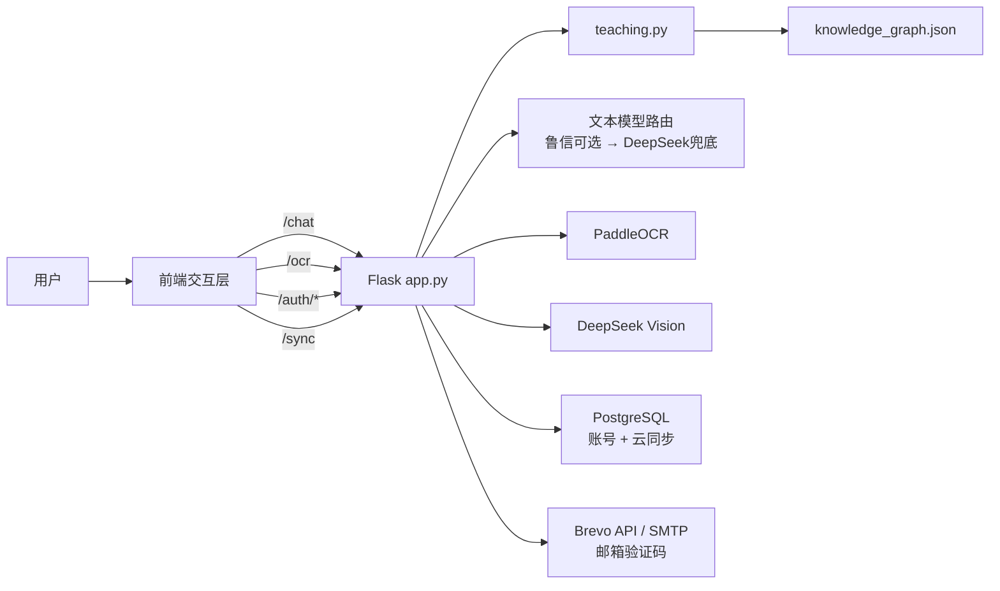

# 系统架构说明

## 1. 总体结构

DMate 当前可以划分为五个逻辑层：

1. **前端交互与题目状态层**：`templates/index.html` + `static/script.js`
2. **账号、会话与同步层**：Flask Session + PostgreSQL + 前端同步状态
3. **Flask 服务编排层**：`app.py`
4. **教学理解与知识组织层**：`teaching.py` + `knowledge_graph.json`
5. **模型、OCR 与外部服务层**：`ai.py` + `ocr.py` + DeepSeek + 可选鲁信通道 + Brevo/SMTP



## 2. 文本学习链路

```text
用户最新输入
→ 前端解析显式题目指代 / 当前题
→ 构造题目锚点与本轮唯一请求
→ POST /chat
→ app.py 清洗、限流、消息长度控制
→ teaching.py 分析教学模式、模块、知识点、题型、难度、难点与前置知识
→ ai.py 根据难度选择思考强度并选择文本提供方
→ 返回回答与 teaching 元数据
→ 前端 Markdown → DOMPurify → MathJax 渲染
→ 更新当前题、会话、学习状态与云同步状态
```

### 教学模式

- `hint`：提示引导
- `full_solution`：完整解析
- `concept`：概念讲解
- `exercise`：练习出题
- `check_answer`：答案诊断

文本题求解默认提示优先；完整解析由明确请求触发。

## 3. 题目难度与模型思考强度

`teaching.py` 对正式题目给出三档难度：

```text
简单 / 中等 / 困难
```

`ai.py` 根据 `teaching_context.difficulty` 选择：

```text
简单 → none
中等 → high
困难 → max
```

对应输出预算分别受 `DEEPSEEK_MAX_OUTPUT_TOKENS`、`MEDIUM_MAX_OUTPUT_TOKENS`、`HARD_MAX_OUTPUT_TOKENS` 控制。

练习生成时，后端把“目标难度”和“生成后的实际难度”分开处理，必要时允许重生成一次。

## 4. 文本模型路由与熔断

文本回答代码支持：

```text
鲁信杯兼容接口（可选、优先）
        ↓ 失败 / 禁用 / 熔断
DeepSeek Chat Completions（兜底）
```

鲁信通道支持：

- `LUXIN_ENABLED` 总开关；
- `LUXIN_MODEL_ID` 显式模型 ID；
- 未配置模型 ID 时一次性 `/v1/models` 探测；
- 后台网络探测；
- 熔断冷却；
- 失败自动切换 DeepSeek。

Vision 不走该文本切换链，继续使用独立 DeepSeek Vision 路径。

## 5. 上下文管理

后端：

```text
MAX_MESSAGES_PER_REQUEST = 32
MAX_MESSAGE_CHARS = 6000
```

AI 历史：

```text
MAX_HISTORY_MESSAGES = 32
MAX_HISTORY_CHARS = 60000
MAX_MESSAGE_CHARS = 6000
```

前端自然语言回退：

```text
FALLBACK_API_CONTEXT_MESSAGES = 12
```

前端优先使用明确题目对象和题目指纹，而不是机械提交完整聊天历史。只有显式题目状态不可用时才退回近期自然语言消息。

## 6. AI 生成题链路

```text
用户要求出题
→ 判断独立出题 / 参照题出题
→ request_kind="exercise"
→ 可选 exercise_reference.question
→ 后端重新分析参照题
→ 解析目标难度
→ 强制 exercise 教学模式
→ AI 生成题目 + 内部参考答案
→ 分离可见题干 / 隐藏答案
→ analyze_question(generated_question)
→ 校验参照题模块与可识别核心知识点是否匹配
→ 校验生成题实际难度
→ 未明确要求难度时不拦截有效题；明确难度不匹配时最多补充生成一次，仍偏离则保留已通过知识点校验的有效题（不保证难度完全匹配）
→ 前端登记为正式生成题
```

独立出题默认中等；参照题出题默认继承参照题难度；显式难度始终优先。若参照题与生成题均能识别出核心知识点，则至少要求一个核心知识点重合；不能识别时不凭空断言偏题。这是课程一致性门槛，并非自动证明题目数学正确。

## 7. OCR + Vision 链路

OCR 模型：

- `PP-OCRv6_small_det`
- `PP-OCRv6_small_rec`
- `PP-FormulaNet_plus-S`
- CPU 推理
- 图片最长边 2200 px

流程：

```text
图片
→ /ocr（8 MiB）
→ EXIF方向处理 + 图像预处理
→ PaddleOCR文字
→ FormulaNet公式
→ DeepSeek Vision校对与图形结构解析
→ Vision 在原调用中标识 exercise / non_exercise / uncertain
→ 明确非题目返回 422、不进入 AI 解题；不确定和纯图题保留核对
→ corrected text + visual text
→ 手机端核对区独立滚动、底部操作固定，识别中隐藏图片入口
→ 前端组合为题目上下文
```

前端可通过 `/ocr/cancel` 撤销识别请求。普通 OCR、公式识别和 Vision 具有故障隔离，尽量保留仍可使用的部分结果。

## 8. 知识组织层

`knowledge_graph.json` 当前包含：

- 10 个模块
- 68 个节点
- 保留“RSA公钥密码”“矩阵树定理”等拓展知识点；本版新增“模逆与中国剩余定理”“图同构”“二部图”“拓扑排序”

`prerequisites` 表示建议学习前置 / 依赖关系，不表示严格逻辑蕴含。

`teaching.py` 可从图结构与常见题干识别图同构、二部图、拓扑排序，从模运算题识别模逆 / 中国剩余定理，也支持无显式“齐次”字样的公式型递推识别。明确题型信号优先落到选择、填空、证明、作图、构造、判断、计算等类型；无法区分时使用“一般题”。

`teaching.py` 主要输出：

- `category`
- `knowledge_points`
- `focus_points`
- `prerequisite_points`
- `knowledge_path`
- `question_type`
- `difficulty`
- `mode`
- `mode_label`

## 9. 账号与数据库结构

账号系统在未配置数据库时不会影响游客模式；配置后使用 PostgreSQL。

主要表：

```text
dm_users       账号、邮箱、密码哈希、恢复码哈希、auth_version
dm_user_data   云同步 JSONB、revision、updated_at
dm_email_codes 邮箱验证码摘要、用途、过期时间、错误次数、消费时间
```

密码和恢复码使用 Werkzeug `scrypt` 哈希；邮箱验证码不保存明文，使用 `AUTH_SECRET_KEY` 参与 HMAC-SHA256 摘要。

## 10. Session 与账号生命周期

服务器 Session Cookie：

- HttpOnly；
- SameSite=Lax；
- Secure 默认开启；
- `PERMANENT_SESSION_LIFETIME = 30 days`；
- 每次请求滚动续期。

`auth_version` 用于使旧 Session 失效；密码重置会提升版本并重新建立当前登录会话。

## 11. 游客、本机缓存与云同步

游客：

```text
会话 / 学习状态 / 外观
→ 只保留当前页面运行状态
→ 不写持久 localStorage
```

登录用户：

```text
前端状态
→ localStorage 本机缓存
→ collectCloudSnapshot()
→ PUT /sync
→ PostgreSQL JSONB
```

云快照包含：

- sessions
- learning
- appearance 参数

自定义背景图片 Blob 使用 IndexedDB，仅保存在当前设备，不进入云快照。

同步通过 `revision` 做乐观并发控制。冲突时后端返回 409 和云端最新数据，前端让用户决定覆盖云端或采用云端版本。

## 12. 错题闭环

```text
正式题目
→ 记为错题
→ 答案 / 解析 / 笔记
→ 完成订正
→ 保存 referenceQuestion
→ exercise_reference 结构化参照
→ 生成同核心知识点复测题
→ 保存 generatedQuestion + hidden generatedAnswer
→ 提交复测答案
→ 独立答案诊断
→ 更新复测统计
```

浏览器端错题上限 80 条。

## 13. 前端内容安全与数学渲染

```text
AI文本
→ 数学内容保护 / 整理
→ Marked
→ DOMPurify sanitize
→ 恢复数学片段
→ MathJax SVG
```

Marked 只负责 Markdown，不承担 HTML 安全过滤。

### 富文本、公式选择与知识图谱图片复制

- 渲染层使用 Marked、DOMPurify 与 MathJax；复制层为普通文字和公式混排内容分别生成 `text/plain` 与 `text/html`。公式在 HTML 里优先使用内嵌 SVG 图片，纯文本使用 LaTeX 回退，保证不支持富文本的环境也有可读结果。
- 页面支持正常文字选区、跨 MathJax 混合选区、公式字形级局部选中；统一高亮颜色，并在复制事件中按当前选择构建内容。输入框仍走浏览器原生复制，不应被富文本拦截。
- 复制按钮按场景限制：聊天只暴露完整题目的复制，错题本每题可复制，弹窗、控件与隐藏部分会在内容序列化时清理。
- 知识图谱复制以完整图形 PNG 为目标，支持 `image/png` 剪贴板时直接写入；不支持则尝试下载 PNG，不退化成纯文字替代。
- 复制功能存在浏览器权限、粘贴目标格式兼容边界；本实现不能保证所有目标编辑器可把 SVG 自动转回可编辑的原生数学公式。

## 14. PDF 导出

```text
错题 DOM
→ 等待 MathJax
→ 处理 SVG / 辅助 MathML
→ html2canvas
→ jsPDF
→ A4 PDF
```

MathJax 使用 `fontCache: 'none'`。

## 15. 服务运行结构

Gunicorn 记录配置：

```text
gunicorn -w 1 --threads 2 --timeout 300 -b 0.0.0.0:${PORT:-8080} app:app
```

进程内 60 秒限流：

- `/chat`：20 次 / 60 秒 / 客户端 IP；
- `/ocr`：10 次 / 60 秒 / 客户端 IP；
- 账号相关接口：按路由分别 20 次 / 60 秒 / 客户端 IP；
- 邮箱验证码另有 60 秒重发、8 次/小时和 6 次错误尝试限制。

## 16. 网页端与安装包的更新边界

- **服务器端**：修改并部署 `app.py` / `teaching.py` / `knowledge_graph.json` 后，新请求执行新的服务器逻辑；不需要重建原生客户端。
- **远程前端**：桌面 Tauri 的 `frontendDist` 与窗口 URL 均指向 `https://dmate.zeabur.app`；Android `DMATE_URL` / WebView 同样指向远程站点。部署 `templates/index.html` 与 `static/script.js` 后，刷新或重启客户端获取新页面（受网络与缓存影响）。
- **安装包自身**：Android 和桌面壳有代码、权限、版本、签名等变更时必须重新构建；目前没有安装包二进制自动升级组件。
- **iOS 主屏幕 Web App**：由 `static/service-worker.js` 管理网络优先缓存；离线 fallback 可能展示上一版。

上述“随服务端生效”指部署成功之后的后续请求，不意味着尚未部署的本地修改会自动出现在用户设备上，也不是无条件实时推送到已打开的页面。
